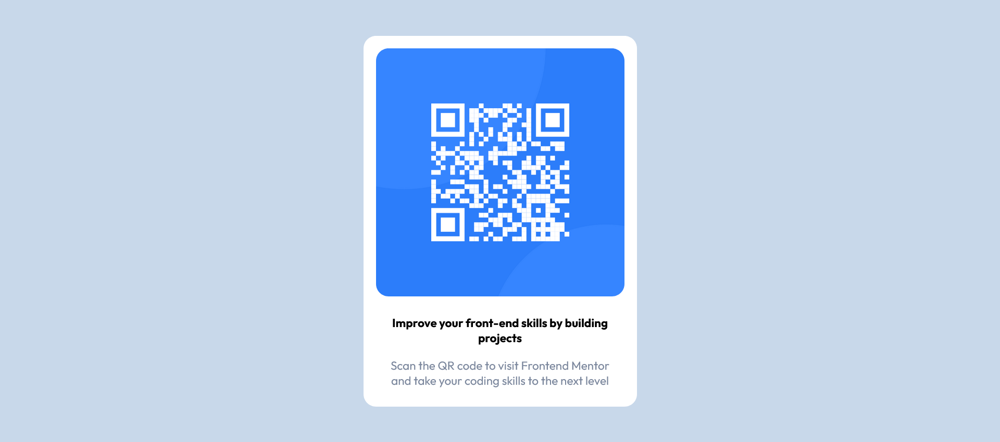

# Frontend Mentor - QR code component

This is a solution to the [QR code component challenge on Frontend mentor] (https://www.frontendmentor.io/challenges/qr-code-component-iux_sIO_H).

## Welcome! 👋

## Overview

### Links

- Solution URL: [You can find my code here](https://github.com/jeffgicharu/QR_Code_Component)
- Live Site URL : [This is the live site of my solution](https://jeffgicharu.github.io/QR_Code_Component/)

### Built with

- Semantic HTML5 markup
- CSS custom properties
- Flexbox
- CSS Grid

### What I learned

- I learned that it is important to first of all finish with the HTML before starting out on the CSS

- I learned about importing fonts from google

- I learned about doing a CSS Reset before styling the other components.